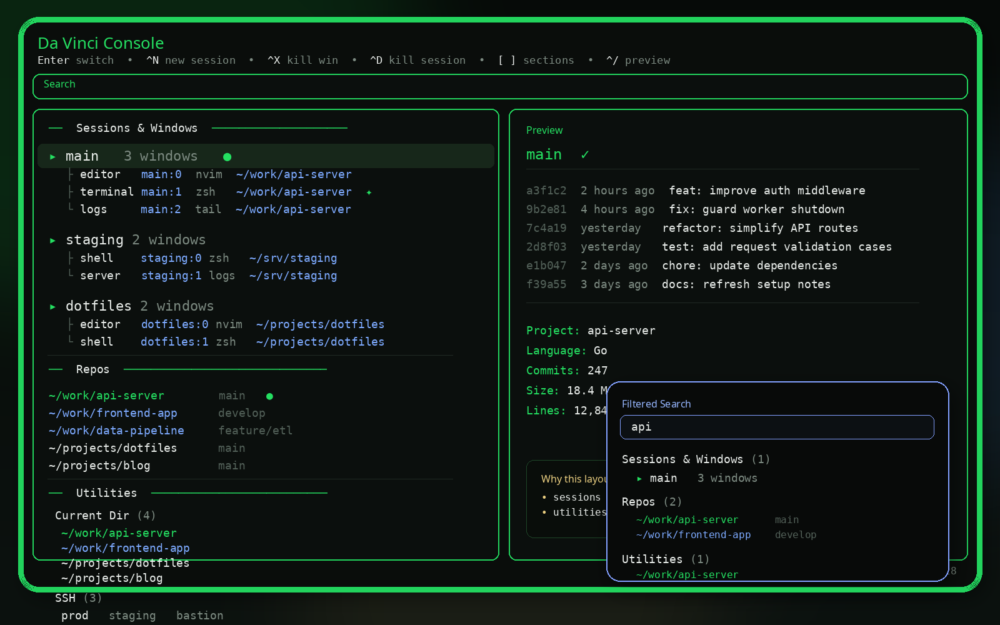

# 󰔎 Da Vinci Console

A tmux session + window picker built on [sesh](https://github.com/joshmedeski/sesh) and [fzf](https://github.com/junegunn/fzf) with a structured sectional layout: `Sessions & Windows` first, `Repos` second, and a compact `Utilities` block at the bottom for `Current Dir`, `SSH`, and optional `Docker`.



---

## Features

- **Structured hierarchy** — `Sessions & Windows` is the anchor block, `Repos` sits beneath it, and `Utilities` keeps support tools compact
- **Global in-place search** — typing filters rows inside each section instead of collapsing everything into one mixed list
- **Section counts** — top-level headers show visible row counts while you search
- **Section jump keys** — `[` and `]` jump between visible top-level sections
- **Auto-discovered repos** — scans `~/` up to 3 levels deep for git repos automatically; pin specific dirs via `SESH_REPO_DIRS`
- **Git branch inline** — current branch shown next to every repo entry
- **Git dirty indicator** — shows `✗ N` in red next to repos with uncommitted changes right in the main list
- **Language icons** — detects Rust, Node, Go, Python, PHP, Java, Ruby, C++ by manifest file
- **Color-coded repos** — work dirs (blue) vs personal dirs (purple), configurable via `SESH_WORK_DIRS`
- **Smart dedup** — repos already open as sessions show `●` in green and switch directly to the existing session instead of opening a duplicate
- **Session timestamps** — shows relative time ("2m ago", "1h ago") next to each session
- **Session tags** — tag sessions with `#work`, `#personal`, etc. and filter by tag with `Ctrl-G`
- **Git preview** — branch, dirty status, last 8 commits, and optional onefetch stats in the preview pane
- **Live pane previews** — see the last 20 lines of any active session or window without switching to it
- **Docker containers** — lists running containers with preview showing image, ports, mounts, and recent logs; Enter opens a shell inside the container
- **SSH bookmarks** — reads `~/.ssh/config` Host entries; Enter opens an SSH connection in a new tmux window
- **Utilities cleanup** — `Current Dir` only shows actionable directories; inert files are hidden
- **Multi-select** (`Tab`) — select multiple items and open them all at once, or batch-kill windows/sessions
- **Pane drill-down** — selecting a window with multiple panes opens a second picker to choose the exact pane
- **`Ctrl-N` new session** — create a session at the selected repo path, or a blank session from scratch when no repo is selected
- **`Ctrl-X` kill window** — kill individual windows without leaving the picker
- **`Ctrl-D` kill session** — delete sessions on the fly
- **`Ctrl-R` rename** — rename the selected session or window inline
- **`Ctrl-S` move window** — move a window to a different session via a nested picker
- **`Ctrl-B` snapshot** — save the current session layout (windows, paths, commands) to a file
- **`Ctrl-O` restore** — restore a previously saved session snapshot
- **Jump mode** (`Ctrl-J`) — sesh configured dirs + zoxide frecency, split into labelled sections
- **Windows view** (`Ctrl-W`) — all windows across all sessions grouped by session
- **Tags view** (`Ctrl-G`) — filter sessions by tag
- **Shell-aware installer** — detects bash/zsh/fish and shows the right config snippet
- **Nerd Font icons** — matched by session name, window name, and running command

---

## Requirements

| Tool                                            | Version   | Notes                                       |
| ----------------------------------------------- | --------- | ------------------------------------------- |
| [tmux](https://github.com/tmux/tmux)            | any       | Obviously                                   |
| [fzf](https://github.com/junegunn/fzf)          | **0.58+** | Requires bordered input/list/preview labels |
| [sesh](https://github.com/joshmedeski/sesh)     | any       | For jump mode and `sesh connect`            |
| [zoxide](https://github.com/ajeetdsouza/zoxide) | any       | Powers jump mode directory list             |
| A [Nerd Font](https://www.nerdfonts.com/)       | any       | For icons to render correctly               |

**Optional:** [onefetch](https://github.com/o2sh/onefetch) — adds rich repo stats to the git preview pane.

> **fzf 0.58+ is required.** Bordered input/list/preview panel labels were introduced in that release. Earlier versions will error.

---

## Install

```bash
git clone https://github.com/purehate/Da_Vinci_Console
cd Da_Vinci_Console
./install.sh
```

The installer copies `da-vinci-console.sh` to `~/.config/tmux/sesh_picker.sh`, detects your shell (bash/zsh/fish), shows the correct env snippet, and checks all dependencies.

---

## Tmux Binding

Add to your `tmux.conf`:

```tmux
bind s display-popup -B -x C -y C -w 72% -h 72% -s "bg=default" -E "~/.config/tmux/sesh_picker.sh"
```

Or see [`extras/tmux.conf`](extras/tmux.conf) for the full snippet. Invoke with `<prefix> s`.

---

## Keybindings

| Key                 | Action                                                           |
| ------------------- | ---------------------------------------------------------------- |
| `Enter`             | Switch to selected session, window, repo, container, or SSH host |
| `Tab` / `Shift-Tab` | Toggle multi-select and move down / up                           |
| `Ctrl-N`            | New session — at selected repo, or blank if no repo selected     |
| `[` / `]`           | Jump to the previous / next visible top-level section            |
| `Ctrl-X`            | Kill the selected window                                         |
| `Ctrl-D`            | Kill the selected session                                        |
| `Ctrl-R`            | Rename the selected session or window                            |
| `Ctrl-S`            | Move the selected window to another session                      |
| `Ctrl-B`            | Snapshot the selected session's layout to a file                 |
| `Ctrl-O`            | Restore a previously saved session snapshot                      |
| `Ctrl-A`            | Return to the default all-sections view                          |
| `Ctrl-J`            | Jump mode — sesh configured dirs + zoxide frecency               |
| `Ctrl-W`            | Windows view — all windows across all sessions                   |
| `Ctrl-G`            | Tags view — filter sessions by tag                               |
| `Ctrl-/`            | Toggle preview pane                                              |
| `Alt-↑` / `Alt-↓`   | Scroll inside preview                                            |
| `Esc` / `Ctrl-C`    | Exit without switching                                           |

---

## Configuration

### Repo directories

Without any config the picker auto-scans `~/` up to 3 levels deep for git repos, skipping hidden dirs, `node_modules`, `.venv`, `vendor`, `target`, `__pycache__`, `dist`, and `build`.

To pin specific directories (faster, more explicit):

```bash
# bash / zsh — add to ~/.bashrc or ~/.zshrc
export SESH_REPO_DIRS="~/DEVELOPMENT:~/work:~/personal"

# fish — add to ~/.config/fish/config.fish
set -gx SESH_REPO_DIRS "$HOME/DEVELOPMENT:$HOME/work:$HOME/personal"
```

Multiple paths are colon-separated. Tilde is expanded automatically.

### Work vs personal colour

Repos found under work dirs render in **blue**; everything else renders in **purple**. The default work dir is `~/DEVELOPMENT`.

```bash
# bash / zsh
export SESH_WORK_DIRS="~/DEVELOPMENT:~/client-work"

# fish
set -gx SESH_WORK_DIRS "$HOME/DEVELOPMENT:$HOME/client-work"
```

### Session tags

Tag sessions for quick filtering with `Ctrl-G`. Create `~/.config/tmux/session-tags.conf`:

```
myproject=work,frontend
dotfiles=personal
client-api=work,backend
```

Each line is `session_name=tag1,tag2`. Tagged sessions show `[work,frontend]` in yellow next to the session name. `Ctrl-G` switches to a filtered view showing only tagged sessions.

### Session snapshots

`Ctrl-B` saves the selected session's layout (window names, working directories, commands) to `~/.config/tmux/snapshots/`. `Ctrl-O` opens a picker to restore any saved snapshot, recreating the session with all its windows.

---

## Adding Icons

Icons are matched in `icon_for()` by session name, window name, or running command. Edit `da-vinci-console.sh` to add your own:

```bash
icon_for() {
    local n="${1,,}"; n="${n##*/}"
    case "$n" in
        myproject*) echo "󱓞" ;;  # add your own here
        claude*)    echo "󰊠" ;;
        # ...
    esac
}
```

The function is called three times per row — for the session name, the window name, and the current pane command — so a single match entry covers all three.

---

## Acknowledgements

- [sesh](https://github.com/joshmedeski/sesh) by Josh Medeski — session manager powering jump mode
- [fzf](https://github.com/junegunn/fzf) by Junegunn Choi — the fuzzy finder engine
- [onefetch](https://github.com/o2sh/onefetch) — repo stats in the preview pane
