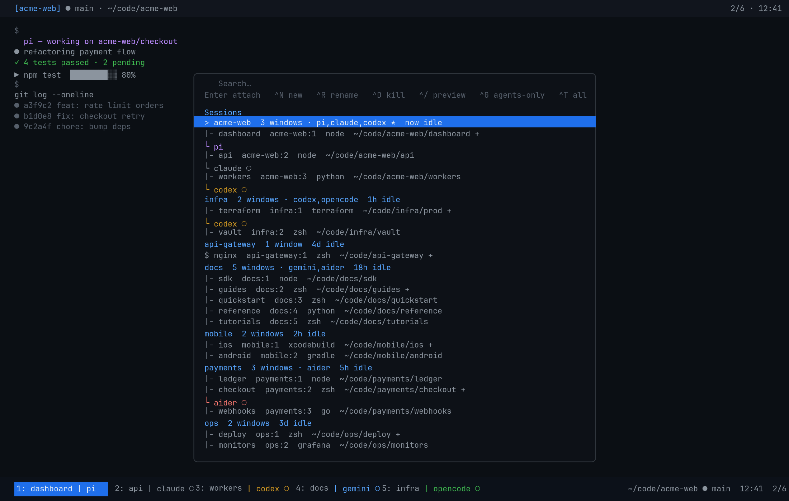

# Da Vinci Console

A focused tmux session picker built with `fzf`.

It only cares about tmux: sessions, windows, panes, and a good-looking live preview.



## Features

- Tmux sessions with nested windows
- Live preview of the selected session or window
- Pane drill-down when a window has multiple panes
- Create, rename, and kill directly from the picker
- Small key set so the UI stays fast to read

## Requirements

| Tool | Notes |
| --- | --- |
| [tmux](https://github.com/tmux/tmux) | Required |
| [fzf](https://github.com/junegunn/fzf) | Required |

## Install

```bash
git clone https://github.com/purehate/Da_Vinci_Console
cd Da_Vinci_Console
./install.sh
```

The installer copies `da-vinci-console.sh` to `~/.config/tmux/sesh_picker.sh`.

## Tmux Binding

Add to your `tmux.conf`:

```tmux
bind s display-popup -B -x C -y C -w 72% -h 72% -s "bg=default" -E "~/.config/tmux/sesh_picker.sh"
```

Or see [`extras/tmux.conf`](extras/tmux.conf).

## Keybindings

| Key | Action |
| --- | --- |
| `Enter` | Switch to selected session/window |
| `Ctrl-N` | Create a new session |
| `Ctrl-R` | Rename selected session/window |
| `Ctrl-D` | Kill selected session/window |
| `Ctrl-/` | Toggle preview |
| `Alt-Up` / `Alt-Down` | Scroll preview |
| `Esc` / `Ctrl-C` | Exit |

## Icons

Icons are intentionally simple ASCII markers so the picker works cleanly without a Nerd Font. Edit `icon_for()` in `da-vinci-console.sh` if you want custom labels for specific sessions, windows, or commands.
